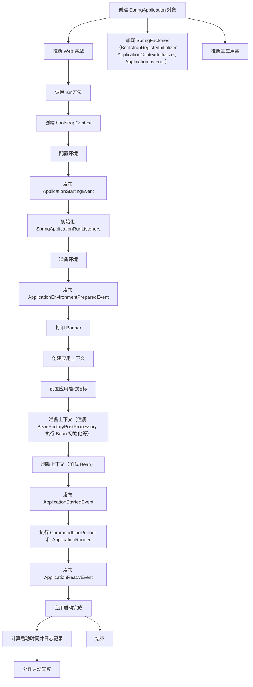

```mermaid
flowchart TB
    A[创建 SpringApplication 对象] --> B[推断 Web 类型]
    A --> C[加载 SpringFactories（BootstrapRegistryInitializer, ApplicationContextInitializer, ApplicationListener）]
    A --> D[推断主应用类]
    B --> E[调用 run方法]
    E --> F[创建 bootstrapContext]
    F --> G[配置环境]
    G --> H[发布 ApplicationStartingEvent]
    H --> I[初始化 SpringApplicationRunListeners]
    I --> J[准备环境]
    J --> K[发布 ApplicationEnvironmentPreparedEvent]
    K --> L[打印 Banner]
    L --> M[创建应用上下文]
    M --> N[设置应用启动指标]
    N --> O[准备上下文（注册 BeanFactoryPostProcessor，执行 Bean 初始化等）]
    O --> P[刷新上下文（加载 Bean）]
    P --> Q[发布 ApplicationStartedEvent]
    Q --> R[执行 CommandLineRunner 和 ApplicationRunner]
    R --> S[发布 ApplicationReadyEvent]
    S --> T[应用启动完成]
    T --> U[计算启动时间并日志记录]
    U --> V[处理启动失败]
    T --> W[结束]
    
  
```